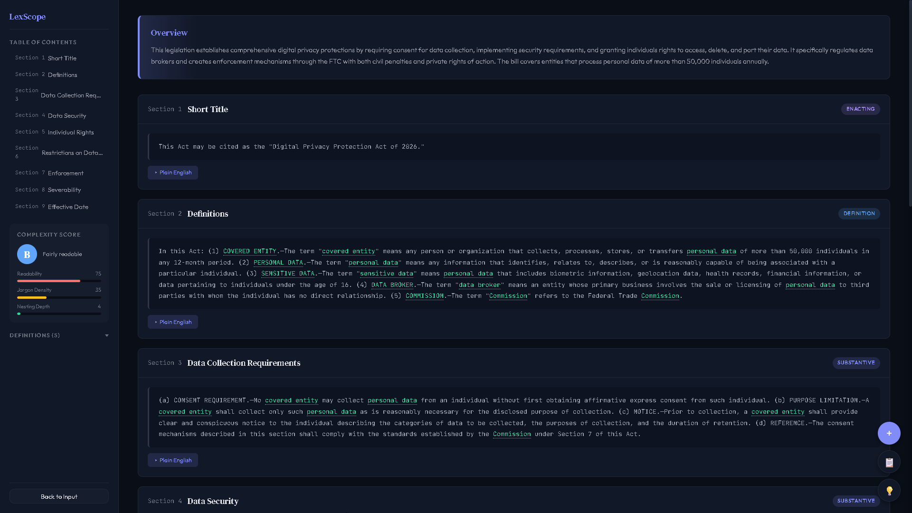

# LexScope

Interactive legislation explorer that turns dense legal text into an understandable, navigable breakdown.

## Features

- **AI-Powered Analysis** — Paste any legislation, bill, or legal text and get structured sections, definitions, cross-references, and plain-English summaries
- **Interactive Document View** — Navigate sections via a sidebar table of contents, hover defined terms for tooltip definitions, click cross-references to jump between sections
- **Complexity Scoring** — Letter grade (A-F) with readability, jargon density, and nesting depth metrics
- **Plain English Summaries** — Toggle plain-language explanations for each section
- **Version Comparison** — Diff two versions of a bill side by side with color-coded change cards showing additions, removals, and modifications
- **Dark Mode UI** — Clean, modern dark theme designed for extended reading
- **Fully Client-Side** — No backend required; runs entirely in the browser
- **Responsive Design** — Works on desktop, tablet, and mobile

## How to Use

1. Visit the [live demo](https://unknownhacker9991.github.io/LexScope/) or clone the repo and open `index.html`
2. Paste any legislation or legal text into the input area
3. Click **Analyze** (or press `Ctrl+Enter`)
4. Explore the interactive breakdown: navigate sections, hover terms, toggle summaries
5. Use **Compare Two Versions** to diff two versions of a bill

## Tech Stack

- Vanilla HTML, CSS, JavaScript (no frameworks)
- CSS custom properties for theming
- Google Fonts (DM Serif Display, Outfit, JetBrains Mono)
- Cloudflare Worker proxy for AI analysis

## Live Demo

[https://unknownhacker9991.github.io/LexScope/](https://unknownhacker9991.github.io/LexScope/)

## License

MIT